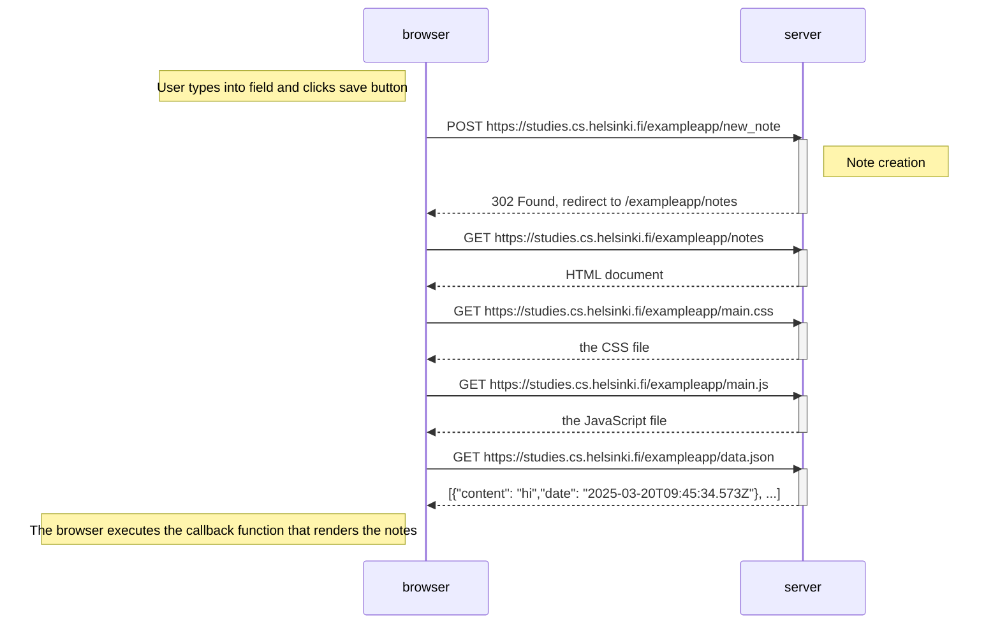

```mermaid
sequenceDiagram
  participant browser
  participant server

  Note left of browser: User types into field and clicks save button
  browser->>server: POST https://studies.cs.helsinki.fi/exampleapp/new_note
  activate server
  Note right of server: Note creation
  server-->>browser: 302 Found, redirect to /exampleapp/notes
  deactivate server

  browser->>server: GET https://studies.cs.helsinki.fi/exampleapp/notes
  activate server
  server-->>browser: HTML document
  deactivate server

  browser->>server: GET https://studies.cs.helsinki.fi/exampleapp/main.css
  activate server
  server-->>browser: the CSS file
  deactivate server

  browser->>server: GET https://studies.cs.helsinki.fi/exampleapp/main.js
  activate server
  server-->>browser: the JavaScript file
  deactivate server

  browser->>server: GET https://studies.cs.helsinki.fi/exampleapp/data.json
  activate server
  server-->>browser: [{"content": "hi","date": "2025-03-20T09:45:34.573Z"}, ...]
  deactivate server

  Note left of browser: The browser executes the callback function that renders the notes
```
